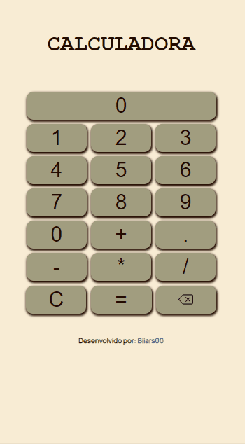

# 7 Days Of Code - Javascript

> Desafio de 7 dias, oferecido pela Alura, utilizando a linguagem JavaScript #7DaysOfCode

- Dia 01: Operadores lógicos.

- Dia 02: Interação com o usuário.

- Dia 03: Estruturas de controle de fluxo.

- Dia 04: Loops e randomização.

- Dias 05 e 06: Arrays e coleções (manipulação de itens).

- Dia 07: Calculadora.
    - Nesse último desafio, utilizei HTML e CSS.

## Demonstração

## Linguagem Utilizada

### Desenvolvido por:

💕 [Beatriz Ribeiro | Biiars00](https://github.com/Biiars00)
